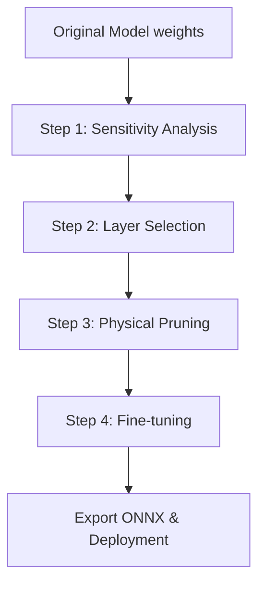

# Hướng dẫn chi tiết: Framework Model Pruning & Sensitivity Analysis (YOLOv5 & RT-DETR)

Tài liệu này cung cấp cái nhìn chi tiết và toàn diện về hệ thống nén mô hình (**Model Pruning**) trong dự án **Prune**. Framework này hỗ trợ cả hai dòng kiến trúc phát hiện vật thể phổ biến: **YOLOv5** (Anchor-based CNN) và **RT-DETR** (Transformer-based Detector).

---

## 📌 Mục lục
1. [Tổng quan hệ thống & Kiến trúc](#1-tổng-quan-hệ-thống--kiến-trúc)
2. [Các phương pháp Pruning (Pruning Methodologies)](#2-các-phương-pháp-pruning-pruning-methodologies)
   - [Structured Channel Pruning (Cắt kênh có cấu trúc)](#structured-channel-pruning-cắt-kênh-có-cấu-trúc)
   - [Unstructured Pruning (Cắt tỉa không cấu trúc)](#unstructured-pruning-cắt-tỉa-không-cấu-trúc)
   - [Layer/Depth Pruning (Cắt bớt độ sâu tầng mạng)](#layerdepth-pruning-cắt-bớt-độ-sâu-tầng-mạng)
   - [Taylor Expansion (Gradient-based) Pruning](#taylor-expansion-gradient-based-pruning)
3. [Tiêu chí đánh giá độ quan trọng (Pruning Criteria)](#3-tiêu-chí-đánh-giá-độ-quan-trọng-pruning-criteria)
4. [Đồ thị phụ thuộc - Dependency Graph (DepGraph)](#4-đồ-thị-phụ-thuộc---dependency-graph-depgraph)
   - [Nguyên lý hoạt động của `torch_pruning`](#nguyên-lý-hoạt-động-của-torch_pruning)
   - [Quy tắc loại trừ lớp nhạy cảm (Exclusion & Protection)](#quy-tắc-loại-trừ-lớp-nhạy-cảm-exclusion--protection)
   - [Chuyển đổi Frozen BatchNorm](#chuyển-đổi-frozen-batchnorm)
5. [Hướng dẫn sử dụng & Lệnh chạy chi tiết](#5-hướng-dẫn-sử-dụng--lệnh-chạy-chi-tiết)
6. [Cấu trúc mã nguồn (Code Architecture)](#6-cấu-trúc-mã-nguồn-code-architecture)

---

## 1. Tổng quan hệ thống & Kiến trúc

Hệ thống được thiết kế theo các nguyên lý **SOLID**, tách biệt rõ ràng giữa logic huấn luyện, đánh giá hiệu năng và cơ chế cắt tỉa vật lý. 



### So sánh hai lớp mô hình hỗ trợ:
*   **YOLOv5**: Chủ yếu là các lớp tích chập (`nn.Conv2d`), kết hợp khối liên kết chéo cục bộ `C3` (BottleneckCSP). Sử dụng cơ chế Anchor.
*   **RT-DETR**: Sử dụng backbone CNN (ResNet/HGNet) và Transformer Encoder-Decoder. Không dùng Anchor, xử lý song song thông qua Object Queries.

---

## 2. Các phương pháp Pruning (Pruning Methodologies)

### Structured Channel Pruning (Cắt kênh có cấu trúc)
*   **Nguyên lý**: Loại bỏ hoàn toàn một số kênh (filters) trong tensor trọng số `weight` của layer tích chập.
*   **Ưu điểm**: Thực sự thu nhỏ kích thước tensor, giảm dung lượng bộ nhớ động và tăng tốc độ inference ngay lập tức trên các phần cứng CPU/GPU phổ thông mà không cần thư viện xử lý thưa (sparse libraries).
*   **Ảnh hưởng liên đới (Domino Effect)**: Khi cắt $N$ kênh đầu ra của Layer $L$, ta bắt buộc phải:
    1.  Cập nhật bias và các trọng số scale, bias, running mean, running variance của lớp `BatchNorm` liền sau Layer $L$.
    2.  Cắt $N$ kênh đầu vào (input channels) tương ứng của Layer $L+1$.
    3.  Đảm bảo tính đồng bộ tại các nhánh nối tắt (Residual Shortcut) hoặc ghép kênh (Concatenation).

### Unstructured Pruning (Cắt tỉa không cấu trúc)
*   **Nguyên lý**: Đặt các giá trị trọng số kém quan trọng về bằng 0 (Zero mask) dựa trên độ lớn của chúng mà không làm thay đổi hình dáng vật lý (`shape`) của tensor.
*   **Cơ chế hoạt động**: Sử dụng mô-đun `torch.nn.utils.prune.l1_unstructured` hoặc `random_unstructured`.
*   **Đặc điểm**: Giữ nguyên kiến trúc mô hình, nhưng cần phần cứng chuyên dụng (ví dụ: Tensor Cores của NVIDIA hỗ trợ 2:4 sparsity) để đạt được tốc độ tăng tốc thực tế.

### Layer/Depth Pruning (Cắt bớt độ sâu tầng mạng)
Thay vì thu nhỏ chiều rộng (số lượng kênh), phương pháp này loại bỏ các khối lặp để giảm độ sâu của mô hình.

#### 1. Đối với YOLOv5 (`prune.py` -> `prune_layers`)
*   Mục tiêu loại bỏ các khối **Bottleneck** nằm bên trong mô-đun `C3` / `BottleneckCSP`.
*   Ví dụ: Khối `C3` ở tầng thứ 4 có chiều sâu mặc định là 2 (chứa 2 khối Bottleneck). Khi áp dụng `--modification prune-layer` với tham số `[(4, 1)]`, khối Bottleneck kém quan trọng nhất dựa trên tiêu chí norm sẽ bị gỡ bỏ vật lý, giúp giảm độ sâu lớp xuống còn 1.

#### 2. Đối với RT-DETR (`prune_rtdetr.py` -> `prune_layers_rtdetr`)
*   Mục tiêu loại bỏ các lớp Transformer Encoder/Decoder.
*   **Xử lý Re-indexing Predict Heads**: RT-DETR có các đầu dự đoán phụ trợ (Auxiliary Heads) liên kết trực tiếp với từng tầng Decoder. Khi một tầng Decoder bị cắt bỏ, các đầu `class_embed` và `bbox_embed` (dạng `nn.ModuleList`) bắt buộc phải được sắp xếp lại chỉ mục (re-index) để khớp chính xác với số lượng tầng Decoder còn lại, đảm bảo quá trình forward pass không bị lỗi chiều dữ liệu.

### Taylor Expansion (Gradient-based) Pruning
Phương pháp này sử dụng thông tin đạo hàm (gradient) tích lũy để đo lường độ nhạy cảm của tham số đối với hàm mất mát.

*   **Công thức toán học (First-Order Taylor Expansion)**:
    $$I_i = \left| \frac{\partial L}{\partial W_i} \cdot W_i \right|$$
    Trong đó $W_i$ là trọng số thứ $i$, $\frac{\partial L}{\partial W_i}$ là gradient tương ứng, và $I_i$ là điểm số quan trọng. Trọng số có điểm số thấp nhất sẽ bị cắt bỏ.
*   **Quy trình Calibrate Gradient (`prune_taylor_yolov5.py`)**:
    1.  Chuyển mô hình sang chế độ huấn luyện (`model.train()`) và kích hoạt tính toán gradient cho toàn bộ tham số.
    2.  Truyền một số batch ảnh hiệu chuẩn (Calibration dataset) hoặc dữ liệu giả lập (dummy input) qua mô hình.
    3.  Tính toán hàm mất mát (Loss) và chạy lan truyền ngược (`loss.backward()`) để tích lũy gradient.
    4.  Sử dụng `torch_pruning` để thực hiện cắt tỉa dựa trên gradient tích lũy này.

---

## 3. Tiêu chí đánh giá độ quan trọng (Pruning Criteria)

Framework cung cấp 7 tiêu chí đánh giá tầm quan trọng của bộ lọc (Filters/Channels). Dưới đây là bảng ánh xạ chi tiết tương ứng với đối số `--criterion`:

| Chỉ mục (`--criterion`) | Phương pháp | Cơ chế tính tầm quan trọng | Mô tả chi tiết |
| :---: | :--- | :--- | :--- |
| **`0`** | **Smallest L2 (Mặc định)** | $\sum \|W_{i, j, k, l}\|_2$ | Ưu tiên giữ lại các filter có tổng bình phương trọng số lớn nhất. Filter nhỏ nhất bị cắt. |
| **`1`** | **Largest L2** | $-\sum \|W_{i, j, k, l}\|_2$ | Ngược lại với mặc định (dùng để thử nghiệm/ablation). |
| **`2`** | **Smallest L1** | $\sum \|W_{i, j, k, l}\|_1$ | Ưu tiên giữ lại filter có tổng trị tuyệt đối trọng số lớn nhất. |
| **`3`** | **Largest L1** | $-\sum \|W_{i, j, k, l}\|_1$ | Ngược lại với tiêu chí 2. |
| **`4`** | **BN Gamma ($\gamma$)** | $|\gamma_i|$ | Sử dụng hệ số tỷ lệ $\gamma$ của tầng Batch Normalization để đo tầm quan trọng. Phù hợp khi áp dụng Network Slimming. |
| **`5`** | **BN Gamma $\times$ L1** | $|\gamma_i| \times \|W_i\|_1$ | Kết hợp thông tin cấu trúc tích chập và tỷ lệ chuẩn hóa BatchNorm. |
| **`6`** | **Random** | Ngẫu nhiên | Lựa chọn ngẫu nhiên các kênh để cắt. Thường dùng để thiết lập baseline đánh giá độ hiệu quả của thuật toán. |

---

## 4. Đồ thị phụ thuộc - Dependency Graph (DepGraph)

### Nguyên lý hoạt động của `torch_pruning`
Trong các mạng hiện đại như YOLOv5 và RT-DETR, các lớp không kết nối tuần tự tuyến tính đơn thuần. Chúng chứa:
*   **Skip-connections (Residual Additions)**: Đòi hỏi số lượng kênh của tensor đầu vào và đầu ra phải trùng khớp hoàn toàn.
*   **Concats (Feature Fusion)**: Ghép nhiều luồng đặc trưng theo chiều kênh. Khi thay đổi kênh của một luồng, vị trí offset của luồng khác trong khối ghép cũng phải thay đổi tương ứng.

`torch_pruning` (`tp.DependencyGraph`) giải quyết vấn đề này bằng cách chạy thử một tensor dữ liệu giả lập qua mô hình (mồi mạng - tracing). Từ đó tự động tạo lập các nhóm liên kết (Pruning Groups). Khi yêu cầu cắt kênh $k$ ở Layer $A$, đồ thị sẽ tự động truy vết ngược xuôi để cắt các kênh tương ứng ở tất cả các lớp phụ thuộc liên quan.

```python
# Đoạn mã khởi tạo đồ thị phụ thuộc an toàn trong prune.py
first_param = next(model.parameters())
x = torch.randn(1, 3, 640, 640).to(device=first_param.device, dtype=first_param.dtype)

# Kích hoạt requires_grad để trace không bị lỗi do thiếu luồng đạo hàm
grad_states = {name: p.requires_grad for name, p in model.named_parameters()}
for p in model.parameters():
    p.requires_grad = True

DG = tp.DependencyGraph().build_dependency(model, x)

# Khôi phục trạng thái gradient ban đầu
for name, p in model.named_parameters():
    p.requires_grad = grad_states[name]
```

### Quy tắc loại trừ lớp nhạy cảm (Exclusion & Protection)
Một số lớp không được phép thay đổi số kênh vì sẽ gây phá vỡ hình dáng đầu ra mong muốn:

*   **YOLOv5**:
    *   **Detect Head Layers**: Các lớp Convolution cuối cùng chiếu đầu ra dự đoán (3 đầu ra tương ứng 3 tỷ lệ). Kênh đầu ra được cố định bằng: `anchors * (classes + 5)`. Ví dụ COCO là $3 \times 85 = 255$ kênh. Các lớp này được tự động bỏ qua trong `prune.py` để tránh lỗi chiều dữ liệu.
*   **RT-DETR**:
    *   Các lớp được bảo vệ bao gồm: Backbone stem (`embedder`), Downsample residual shortcuts (`shortcut`), Multi-scale projections (`encoder_input_proj`, `decoder_input_proj`), transformer attention layers (`model.encoder.aifi`), Decoder heads, Prediction heads (`enc_score_head`, `enc_bbox_head`), và Denoising embeddings.

### Chuyển đổi Frozen BatchNorm
Hugging Face RT-DETR sử dụng `RTDetrFrozenBatchNorm2d` để tối ưu hóa tài nguyên trong quá trình fine-tune (đóng băng thông số chuẩn hóa). Tuy nhiên, lớp này không tương thích hoàn toàn với thư viện truy vết đồ thị `torch_pruning`.

*   **Giải pháp**: Trong `prune_rtdetr.py`, hàm `replace_frozen_bn` tìm kiếm tất cả các lớp Frozen BatchNorm và chuyển đổi vật lý chúng thành lớp `nn.BatchNorm2d` chuẩn, đồng thời sao chép chính xác các thông số trọng số (`weight`, `bias`, `running_mean`, `running_var`) sang lớp mới trước khi thực hiện phân tích đồ thị phụ thuộc.

---

## 5. Hướng dẫn sử dụng & Lệnh chạy chi tiết

> [!NOTE]
> Hãy chắc chắn bạn đã kích hoạt đúng môi trường ảo conda (ví dụ: `conda activate env_cv`) trước khi thực thi các lệnh dưới đây.

### 1. Phân tích độ nhạy (Sensitivity Analysis)
Để hiểu rõ mức độ ảnh hưởng đến độ chính xác (mAP) khi cắt tỉa từng lớp cụ thể:

*   **YOLOv5s (Structured Channel)**:
    ```bash
    python sensitivity_analysis.py --data data/coco.yaml --img-size 640 --batch-size 32 --device 0 --weights weights/yolov5s.pt --modification prune-structured --prune-output yolov5s_sensitivity.txt --pruning-rate "[0.05, 0.10, 0.20, 0.30, 0.50, 0.75]"
    ```
*   **YOLOv5s (Layer/Depth)**:
    ```bash
    python sensitivity_analysis.py --data data/coco.yaml --img-size 640 --batch-size 32 --device 0 --weights weights/yolov5s.pt --modification prune-layer --criterion 0 --prune-output yolov5s_layer_sensitivity.txt
    ```
*   **RT-DETR-R18 (Structured)**:
    ```bash
    python test_rtdetr.py --data data/coco_1000.yaml --weights PekingU/rtdetr_r18vd --batch-size 32 --device 0 --ann-file ./coco/annotations/instances_val2017.json --img-dir ./coco/images/val2017 --name rtdetr_r18vd_sensitivity --task pruning_sensitivity_analysis --pruning-rate "[0.05, 0.10, 0.20, 0.25, 0.50, 0.75]" --modification prune-structured
    ```

### 2. Tự động chọn Layer tối ưu (Layer Selection)
Tính toán điểm số tối ưu dựa trên độ nhạy (Saves vs. mAP Loss) để đưa ra đề xuất danh sách layer cần cắt tỉa:
```bash
python layer_selection.py --output output/yolov5s --params 7225885 --flops 16.436 --params-layers 6 --flops-layers 5
```

### 3. Thực thi Pruning & Lưu Checkpoint
*   **YOLOv5s (Cắt kênh vật lý)**:
    ```bash
    python prune.py --weights weights/yolov5s.pt --modification prune-structured --pruning-params "[(0, 0.25), (42, 0.5), (45, 0.5), (48, 0.25)]" --criterion 0 --name weights/yolov5s-pruned.pt
    ```
*   **YOLOv5s (Cắt bớt Bottlenecks trong C3)**:
    ```bash
    python prune.py --weights weights/yolov5s.pt --modification prune-layer --pruning-params "[(4,1),(6,1)]" --criterion 0 --name weights/yolov5s-layer-pruned.pt
    ```
*   **YOLOv5s (Taylor Gradient Pruning)**:
    ```bash
    python prune_taylor_yolov5.py --weights weights/yolov5s.pt --ratio 0.2 --output weights/yolov5s-taylor-pruned.pt --data data/coco500.yaml --batch-size 16 --calib-batches 4
    ```
*   **RT-DETR-R18 (Structured)**:
    ```bash
    python prune_rtdetr.py --weights PekingU/rtdetr_r18vd --output-path weights/rtdetr-pruned.pt --pruning-params "[(12, 0.3), (13, 0.3)]" --criterion 0 --modification prune-structured
    ```

### 4. Đánh giá kiểm thử
Đánh giá độ chính xác của mô hình sau khi cắt tỉa (chưa hoặc đã fine-tune):
```bash
python test.py --data data/coco.yaml --img-size 640 --batch-size 32 --device 0 --weights weights/yolov5s-pruned.pt
```

### 5. Huấn luyện phục hồi độ chính xác (Fine-tuning)
```bash
python train.py --weights weights/yolov5s-pruned.pt --data data/coco128.yaml --epochs 50 --batch-size 16 --img-size 640 --device 0
```

---

## 6. Cấu trúc mã nguồn (Code Architecture)

```
Prune/
├── datasets/                 # Chứa coco dataset loader cho DETR
├── evaluation/               # Thành phần lõi quản lý evaluation & adapters
│   ├── core.py               # Vòng lặp Validation chuẩn, tính toán Precision/Recall/mAP, Params, FLOPs
│   ├── dataset.py            # Quản lý dataloader biệt lập để tránh xung đột thư viện Hugging Face
│   ├── model_adapter.py      # Module điều phối giao diện chung (YOLOAdapter, DETRAdapter)
│   └── sensitivity.py        # Quản lý logic chạy Sensitivity Analysis
├── sensitivity_analysis.py   # Lệnh gọi SA từ CLI
├── prune.py                  # Điểm khởi chạy vật lý Structured/Layer pruning cho YOLOv5
├── prune_rtdetr.py           # Điểm khởi chạy Structured/Unstructured/Layer pruning cho RT-DETR
├── prune_taylor_yolov5.py    # Triển khai First-Order Taylor gradient-based pruning cho YOLOv5
├── layer_selection.py        # Giải thuật tối ưu chọn lựa layer dựa trên kết quả SA
├── run_benchmark.py          # Benchmark tự động hiệu năng mô hình (vẽ biểu đồ so sánh)
└── README.md                 # Tài liệu hướng dẫn sử dụng nhanh
```
