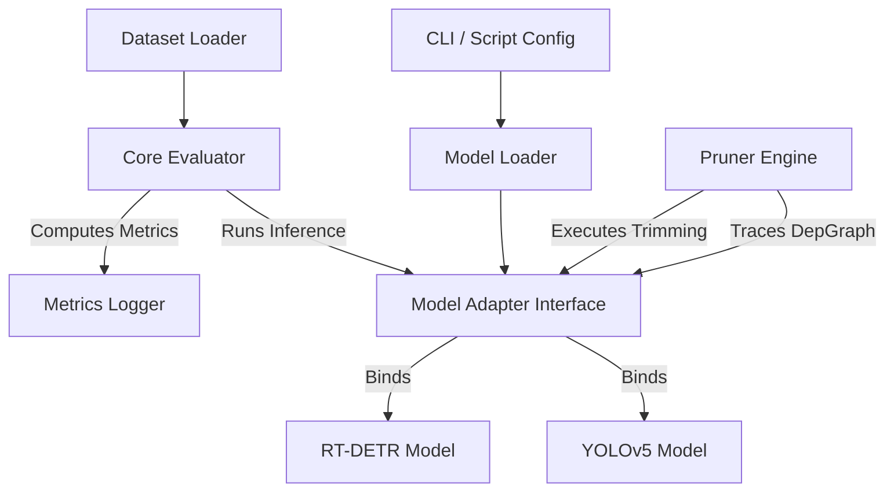
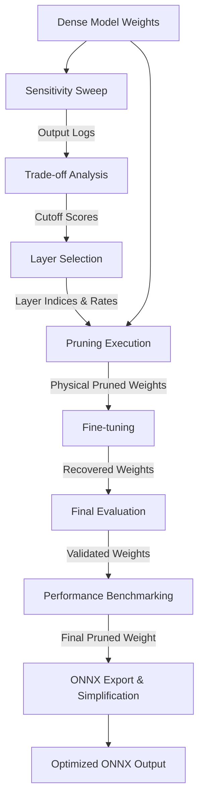
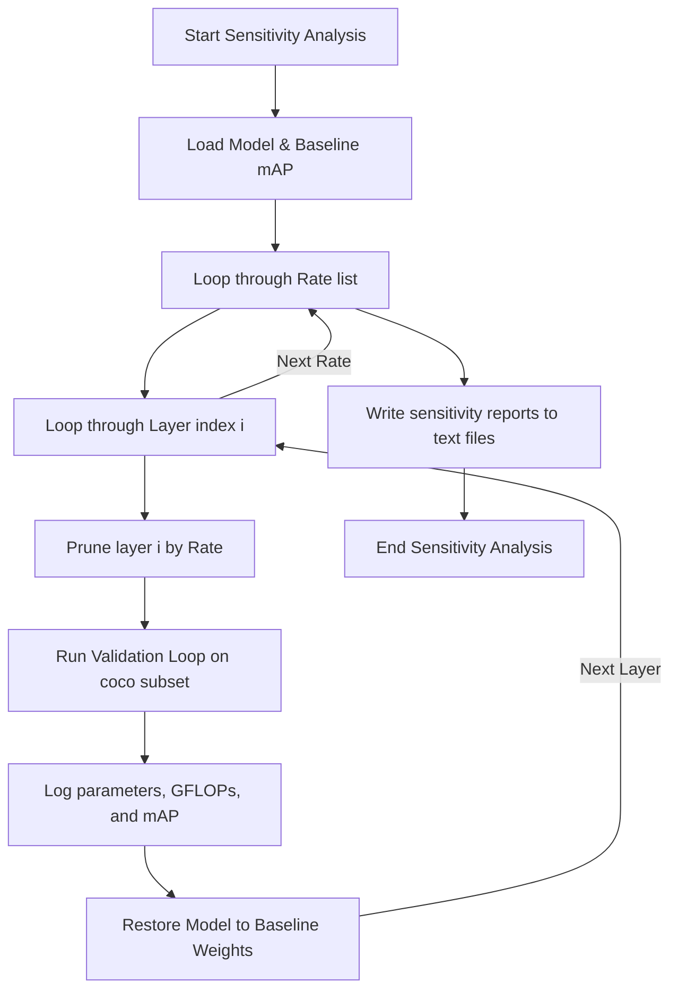
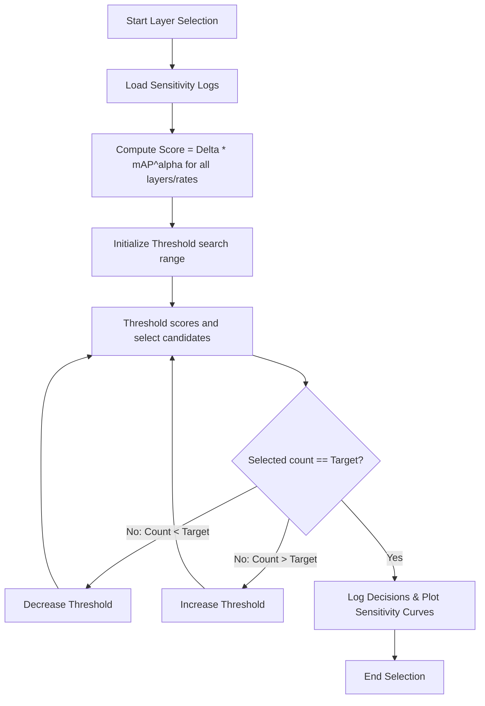
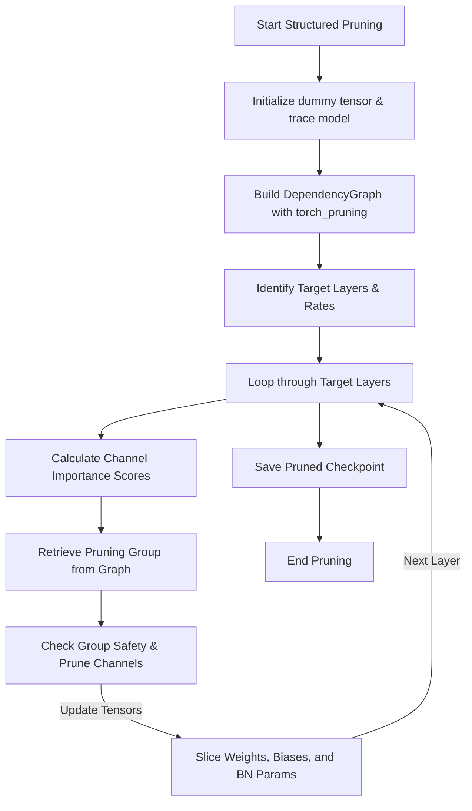
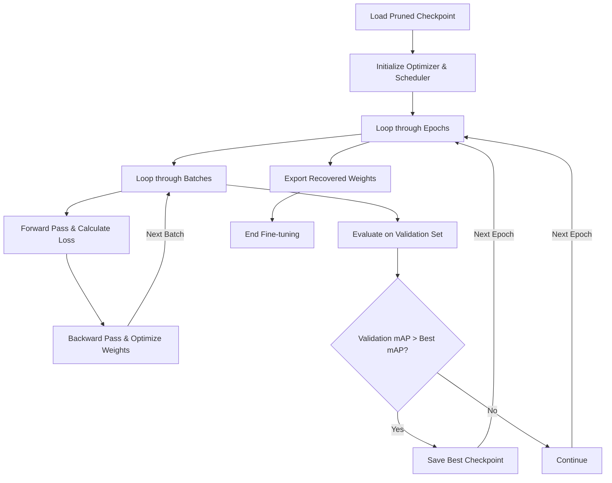
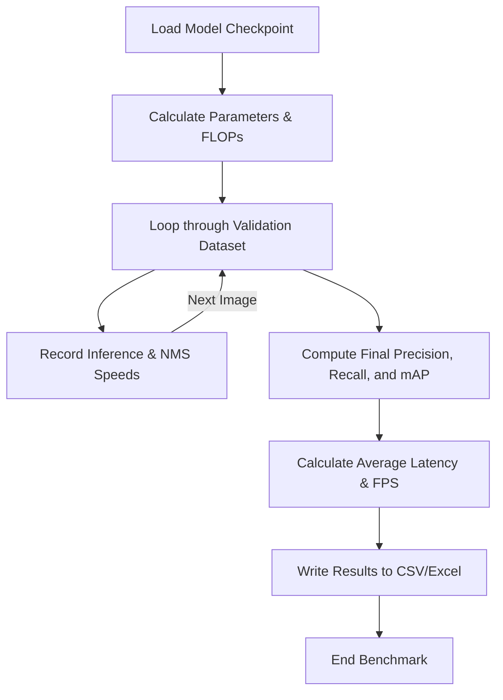

# Model Pruning & Sensitivity Analysis Framework: Technical Documentation
**A Comprehensive Guide to Structured, Layer, and Taylor Expansion Pruning for YOLOv5 and RT-DETR Architectures**

---

## Chapter 1. Introduction

### Project Overview
The **Model Pruning & Sensitivity Analysis Framework** is an end-to-end, production-grade model compression suite designed to accelerate object detection models for Edge AI deployment. The repository implements structured channel pruning, layer (depth) pruning, and gradient-based Taylor expansion pruning, coupled with an automated sensitivity analysis and layer selection system. The framework focuses on two distinct families of object detectors:
1. **YOLOv5**: A highly-optimized, anchor-based convolutional neural network (CNN).
2. **RT-DETR (Real-Time DEtection TRansformer)**: A transformer-based object detector utilizing a CNN backbone and a Vision Transformer Encoder-Decoder structure.

### Objectives
* **Compute Reduction**: Lower the floating-point operations (FLOPs) and physical parameter counts of models.
* **Latency Acceleration**: Improve inference speed (FPS) on target hardware (CPU and GPU).
* **Automated Optimization**: Remove manual trial-and-error by profiling layer sensitivity and automatically selecting optimal layers and pruning rates.
* **Accuracy Recovery**: Provide a structured fine-tuning pipeline to regain accuracy lost during physical pruning.
* **Deployment Readiness**: Simplify model exportation to ONNX format with graph corrections for high-performance runtime execution.

### Features
* **Multi-Strategy Pruning**:
  * **Structured Channel Pruning**: Trims output filters of convolutions and updates subsequent layers.
  * **Unstructured Pruning**: Masks individual weights to zero for sparse execution (supported for RT-DETR).
  * **Layer/Depth Pruning**: Physically removes Bottleneck blocks inside C3/CSP modules for YOLOv5, or entire Encoder/Decoder layers for RT-DETR.
  * **First-Order Taylor Pruning**: Dynamically evaluates channel importance using gradient-weight inner products.
* **7 Importance Criteria**: Supports L1-norm, L2-norm, BatchNorm scaling factors ($\gamma$), and composite metrics.
* **Dependency Tracing**: Implements robust tracing with `torch_pruning` to handle residual connections and concatenation branches safely.
* **Unified Model Interface**: Utilizes the Model Adapter design pattern to isolate model-specific inference, preprocessing, and postprocessing.

### Supported Models
* **YOLOv5 Series**: Custom and standard variants (e.g., `YOLOv5s`, `YOLOv5m`, `YOLOv5l`, `YOLOv5x`).
* **RT-DETR Series**: Hugging Face-based architectures, specifically verified with `PekingU/rtdetr_r18vd`.

### Project Structure Mappings
To ensure readability, the project modules are mapped logically as follows:
* **Models**: `/models/` contains YOLOv5 architectures and custom pruned layers.
* **Evaluation & Profiling**: `/evaluation/` holds validation loops, adapters, and sensitivity modules.
* **Datasets**: `/datasets/` and root modules manage data loading and transformations.
* **Pruning Logic**: Embedded in root scripts (`prune.py`, `prune_rtdetr.py`, `prune_taylor_yolov5.py`).
* **Benchmark & Export**: Root scripts manage profiling and ONNX conversion.
* **Downstream Applications**: `/traffic_analysis/` and root-level scripts use pruned weights for practical vehicle tracking/counting.

---

## Chapter 2. Technical Background

### Edge AI
Edge AI refers to deploying machine learning models directly on physical, localized devices (e.g., microcontrollers, embedded boards, IP cameras, edge servers) rather than sending data to cloud servers. It requires models to operate under strict power, memory, heat, and computational limits while delivering real-time, low-latency responses.

### AI Model Optimization
Model optimization is the process of altering a deep learning network's structure, parameters, or execution logic to improve computational efficiency. Optimization aims to balance hardware execution speed, memory footprint, energy consumption, and task accuracy.

### Model Compression
Model compression is a subset of optimization focusing on shrinking the physical file size and parameter count of a network. Primary techniques include weight pruning (removing weights), quantization (reducing numerical precision), and knowledge distillation (transferring knowledge from a large teacher to a small student).

### Neural Network Pruning
Pruning is the systematic removal of weights, channels, or layers from a neural network. It assumes that deep learning models are over-parameterized and contain redundant connections that do not contribute significantly to the final prediction.

### Unstructured Pruning
Unstructured pruning sets individual weight parameters to zero if they fall below an importance threshold, without altering the shape of the tensor. While it achieves high theoretical sparsity, it requires specialized hardware or sparse kernels (e.g., NVIDIA Ampere 2:4 sparsity) to yield actual speedups.

### Structured Pruning
Structured pruning removes entire structural components of a network—such as convolutional filters, channels, or entire layers. Because it physically shrinks weight tensors, it results in direct latency reduction and memory savings on standard CPUs and GPUs without requiring specialized sparse hardware libraries.

### Layer Importance Criteria
Pruning requires scoring the importance of channels or weights. Criteria range from magnitude-based norms (L1/L2 norm of weights), module parameter monitoring (BatchNorm scale factors $\gamma$), to gradient-based scores (Taylor expansion) which measure the parameters' direct effect on the network's loss function.

### Dependency Graph (DepGraph)
Modern network architectures use residual skip-connections and channel concatenations. Changing the output channels of one layer forces changes in the input channels of downstream layers. A Dependency Graph (DepGraph) traces these connections, grouping dependent parameters together to ensure the network remains structurally valid after pruning.

### Sensitivity Analysis
Sensitivity Analysis profiles the model layer-by-layer by pruning one layer at a time and evaluating the resulting accuracy (e.g., mAP) on a validation dataset. This identifies which layers are robust to pruning and which are highly sensitive, providing a roadmap for automated layer selection.

### Fine-tuning
Pruning physically damages the model's representations, causing an immediate drop in accuracy. Fine-tuning uses a small learning rate to retrain the remaining weights on the training dataset, allowing the model to adapt its remaining parameters and recover lost performance.

### Benchmarking Metrics
* **Parameters**: The total count of trainable weight variables. Directly correlates with the model's disk storage footprint.
* **FLOPs (Floating Point Operations)**: A measure of computational complexity. Typically expressed in GFLOPs (giga-FLOPs).
* **Latency**: The time taken (in milliseconds) to process a single input image.
* **FPS (Frames Per Second)**: The throughput of the model, computed as $1000 / \text{Latency (ms)}$.
* **Model Size**: The physical size of the exported checkpoint file on disk (in MB).
* **mAP (Mean Average Precision)**: The standard evaluation metric for object detection. Measured at IoU threshold 0.5 (`mAP@0.5`) and averaged over IoU thresholds 0.5 to 0.95 (`mAP@0.5:0.95`).

---

## Chapter 3. System Architecture

### Overall Architecture
The framework decouples model definition, dataset loading, and evaluation logic from the physical pruning algorithms through the **Model Adapter** design pattern. 



### Module Interaction
* **ModelAdapter**: Unifies input image resizing, tensor formatting, and prediction extraction. `YOLOAdapter` and `DETRAdapter` wrap their respective models.
* **Core Evaluator (`evaluation/core.py`)**: Executes inference over a validation loop, calling the active adapter. It measures metrics (Precision, Recall, mAP) and profiles execution times.
* **Sensitivity Profiler (`evaluation/sensitivity.py`)**: Iterates through layers, applies temporary pruning, runs the Core Evaluator, and writes sensitivity profiles to files.
* **Pruner (`prune.py` / `prune_rtdetr.py` / `prune_taylor_yolov5.py`)**: Accesses the underlying model, constructs the Dependency Graph, executes physical tensor slicing, and saves the optimized model checkpoint.

### Folder Structure
The physical layout of the repository and its structural mappings:
```
Prune/
├── cfg/                      # Legacy config files (represented in project configs)
├── data/                     # Dataset configuration YAMLs (e.g., coco.yaml, coco1000.yaml)
├── datasets/                 # DETR-specific datasets and image transforms
│   ├── coco.py               # Custom COCO dataset wrappers
│   └── transforms.py         # Image normalization, padding, and resizing
├── evaluation/               # CORE MODULE: Decoupled model adaptation and evaluation
│   ├── config.py             # Global evaluator configurations & logger
│   ├── core.py               # Main validation loop & metric computation
│   ├── dataset.py            # Dataset loading routing
│   ├── metrics.py            # AP calculation, Precision-Recall curves, confusion matrices
│   ├── model_adapter.py      # Abstract ModelAdapter, YOLOAdapter, DETRAdapter, ModelLoader
│   ├── results.py            # JSON/TXT validation logging and plotting
│   └── sensitivity.py        # Layer-wise and channel-wise sensitivity loops
├── models/                   # YOLOv5 architecture files
│   ├── common.py             # Bottleneck, C3, SPP, Focus, and standard modules
│   ├── experimental.py       # Helper functions for weight loading
│   ├── pruned_common.py      # Custom pruned layers allowing arbitrary dimensions
│   └── yolo.py               # Network parser and Detect Head definition
├── utils/                    # YOLOv5 helper scripts
│   ├── augmentations.py      # Data augmentations (letterbox, transforms)
│   ├── autoanchor.py         # Anchor box estimation utilities
│   ├── datasets.py           # YOLO-specific loaders
│   ├── general.py            # Non-Maximum Suppression (NMS), bounding box scaling, check_file
│   ├── loss.py               # YOLOv5 loss functions
│   ├── plots.py              # Visualisation and analysis plotting
│   └── torch_utils.py        # PyTorch helper functions (devices, profiling, init)
├── docs/                     # Documentation files
│   └── PRUNING_GUIDE.md      # Detailed markdown guide for pruning processes
├── benchmarks/               # Directory containing generated CSV/XLSX reports and PNG charts
└── [Root Scripts]            # CLI entry points for pruning, selection, and export
```

### Data Flow
1. **Model & Config Initialization**: Model weights are loaded and mapped to a `ModelAdapter`.
2. **Preprocessing**: The input image is resized using `letterbox` (YOLOv5) or padded/normalized (RT-DETR) to shape `(Batch, 3, Width, Height)`.
3. **Inference**: The preprocessed tensor is passed to the adapter. The model executes the forward pass.
4. **Postprocessing**: Raw tensor outputs are processed via NMS (`non_max_suppression`) to filter overlapping boxes.
5. **Metric Accumulation**: Output coordinates are scaled back to the original image dimensions, compared against annotations, and logged.

### End-to-End Pipeline


---

## Chapter 4. Code Architecture

### 1. models/
* **common.py**: Defines YOLOv5 building blocks (`Conv`, `Bottleneck`, `C3`, `SPPF`, `Concat`).
* **experimental.py**: Implements model loading abstractions (`attempt_load`, `attempt_download`) to load weights safely.
* **pruned_common.py**: Implements custom classes `BottleneckPruned`, `C3Pruned`, and `SPPFPruned`. These accept individual, custom channel shapes for inner convolutions, avoiding expansion constraints.
* **yolo.py**: Parses model configuration YAMLs and builds the network graph. Defines the `Detect` head.

### 2. evaluation/
* **core.py**: Coordinates evaluation. Function `evaluate` computes mAP, Precision, Recall, and logs latency.
* **model_adapter.py**: Implements the Model Adapter pattern (`YOLOAdapter`, `DETRAdapter`) to unify forward pass interfaces.
* **sensitivity.py**: Implements layer-wise pruning loops to profile sensitivity.
* **metrics.py** & **results.py**: Handle confusion matrices, AP calculations, and text/JSON logging.

### 3. datasets/ & dataset_coco_rtdetr.py
* **coco.py** & **transforms.py**: Implement custom dataset classes and image transforms for RT-DETR, decoupling them from Hugging Face dependencies to avoid namespace shadowing.
* **dataset_coco_rtdetr.py**: Entry script for RT-DETR validation dataset compilation.

### 4. Root Pruning Modules
* **prune.py**: Script for structured and layer pruning of YOLOv5. Builds dependency graphs, matches importances, and prunes layers.
* **prune_rtdetr.py**: Implements structured, unstructured, and layer pruning for RT-DETR models. Handles Frozen BatchNorm replacement and prediction head re-indexing.
* **prune_taylor_yolov5.py**: Runs Taylor expansion pruning. Calibrates gradients on datasets and applies pruning based on gradient-weight importance.

### 5. Benchmark & Plotting
* **run_benchmark.py** & **run_benchmark_rtdetr.py**: Evaluate multiple checkpoints on validation splits and save metrics to CSV and XLSX.
* **plot_benchmark.py**: Visualizes benchmark comparisons (FLOPs, parameters, latency, mAP) as charts.

### 6. Export
* **export.py**: Exports YOLOv5 PyTorch weights to ONNX, configuring dynamic axes.
* **export_rtdetr_onnx.py**: Exports RT-DETR to ONNX, wrapping outputs to logits and boxes, and converting float64 cast nodes to float32.

---

### Detailed File Analysis

#### `prune.py`
* **Purpose**: Performs structured channel pruning and layer-level depth pruning on YOLOv5 models.
* **Input**: Dense PyTorch model (`.pt`), modification flags, pruning parameters, and selection criteria.
* **Output**: Pruned PyTorch model (`.pt`).
* **Key Functions**:
  * `prune_structured(model, pruning_params, criterion)`: Traces the dependency graph using `torch_pruning`, calculates channel importances, and physically trims output channels.
  * `prune_layers(model, pruning_params, criterion)`: Removes Bottleneck blocks from C3 modules based on importance criteria.
  * `determine_pruned_indices(conv, bn, percentage, criterion)`: Calculates channel importance scores and returns indices to prune.
* **Dependencies**: `torch`, `torch_pruning`, `models.common`, `models.pruned_common`.

#### `prune_rtdetr.py`
* **Purpose**: Implements pruning (structured, unstructured, layer) for Hugging Face-based RT-DETR.
* **Input**: RT-DETR checkpoint, modification type, and layers list.
* **Output**: Pruned RT-DETR model checkpoint.
* **Key Functions**:
  * `prune_structured_global(...)`: Traces dependencies, handles stem/AIFI/decoder exclusions, and prunes channels.
  * `prune_layers_rtdetr(...)`: Remodels encoder/decoder modules and re-indexes prediction heads.
  * `replace_frozen_bn(model)`: Converts `RTDetrFrozenBatchNorm2d` to standard `BatchNorm2d` for compatibility.
* **Dependencies**: `torch`, `torch_pruning`, `transformers`, `evaluation.model_adapter`.

#### `layer_selection.py`
* **Purpose**: Selects optimal layers and pruning rates under parameter or FLOP constraints.
* **Input**: Sensitivity analysis text files, baseline parameters/FLOPs, and targets.
* **Output**: List of layers and pruning rates.
* **Key Functions**:
  * `select(...)`: Loops over rates, scores layers using $\Delta \times mAP^{\alpha}$, and uses binary search to find threshold parameters.
* **Dependencies**: `numpy`, `matplotlib`, `argparse`.

---

## Chapter 5. Core Algorithms

### 1. Sensitivity Analysis
* **Purpose**: Map model degradation as a function of pruning rate for individual layers.
* **Theory**: Pruning a layer changes its filters, altering output feature maps. Evaluating this degradation independently helps identify the model's structural bottlenecks.
* **Implementation**: Iterates through convolutional layers (structured mode) or C3 modules (layer mode). It prunes the target layer by a specified rate, evaluates mAP on validation data, logs metrics, restores weights, and repeats.
* **Advantages**: Accurate, localized profiling; requires no gradient calculation.
* **Limitations**: High computational cost.
* **Complexity**: $O(L \cdot R \cdot N_{val})$ where $L$ is layers, $R$ is rate steps, and $N_{val}$ is validation images.



#### Sensitivity Analysis Pseudocode
```python
def run_sensitivity_analysis(model, layers, rates, eval_dataset):
    baseline_map = evaluate(model, eval_dataset)
    profiles = []
    for rate in rates:
        rate_log = []
        for layer in layers:
            pruned_model = apply_temporary_pruning(model, layer, rate)
            map_score, params, flops = evaluate(pruned_model, eval_dataset)
            rate_log.append((layer, map_score, params, flops))
            restore_weights(model)
        profiles.append((rate, rate_log))
    return profiles
```

---

### 2. Layer Selection
* **Purpose**: Select which layers to prune and at what rates to meet compression targets.
* **Theory**: Uses a weighted scoring formula to balance compression gains against accuracy loss:
  $$Score(L_i, r) = \Delta(L_i, r) \times [mAP(L_i, r)]^{\alpha}$$
  where $\Delta$ is saved parameters or FLOPs, and $\alpha$ is a sensitivity exponent (default 20).
* **Implementation**: Reads sensitivity logs, computes scores for all combinations, and searches for a threshold that selects the target number of layers using a binary search loop.
* **Advantages**: Automated and fast; balances accuracy and compression.
* **Limitations**: Greedy search; ignores combined sensitivity of pruning multiple layers simultaneously.
* **Complexity**: $O(L \cdot R)$ score calculations, $O(I \cdot L)$ binary search steps, where $I$ is iterations.



#### Layer Selection Pseudocode
```python
def select_layers(sensitivity_data, target_count, alpha):
    scores = []
    for entry in sensitivity_data:
        param_saved = entry.baseline_params - entry.pruned_params
        score = param_saved * (entry.mAP ** alpha)
        scores.append((entry.layer_id, entry.rate, score))
        
    frac = 2.0
    for iteration in range(5000):
        threshold = max(scores) / frac
        selected = [item for item in scores if item.score > threshold]
        if len(selected) == target_count:
            break
        elif len(selected) < target_count:
            frac += 0.001
        else:
            frac -= 0.001
    return selected
```

---

### 3. Structured Pruning
* **Purpose**: Remove structural parameters from layers while maintaining network validity.
* **Theory**: Pruning a layer's output channels requires modifying dependent layers (BatchNorm parameters, downstream layer input weights, residual connections).
* **Implementation**: Traces the network using `torch_pruning` to construct a dependency graph. It groups dependent parameters, calculates channel importances (L1/L2 norms, BN gamma), identifies indices to remove, slices the tensors, and updates the graph.
* **Advantages**: Shrinks tensors physically, reducing latency on standard hardware.
* **Limitations**: Tracing errors can occur on complex custom layers.
* **Complexity**: $O(G \cdot C^2)$ where $G$ is the dependency group size and $C$ is the number of channels.



#### Structured Pruning Pseudocode
```python
def structured_pruning(model, targets, criterion):
    dummy_input = torch.randn(1, 3, 640, 640)
    DG = tp.DependencyGraph().build_dependency(model, dummy_input)
    
    for layer_idx, rate in targets:
        conv = get_conv_layer(model, layer_idx)
        scores = calculate_importance(conv, criterion)
        prune_indices = get_lowest_indices(scores, rate)
        
        pruning_group = DG.get_pruning_group(conv, tp.prune_conv_out_channels, idxs=prune_indices)
        if DG.check_pruning_group(pruning_group):
            pruning_group.prune()
            
    return model
```

---

### 4. Fine-tuning
* **Purpose**: Restore model accuracy after pruning.
* **Theory**: Retraining adjusts the remaining parameters to compensate for the pruned capacity.
* **Implementation**: Loads the pruned model, applies weight regularization, and trains using SGD or Adam. Uses cosine annealing learning rate schedulers and saves checkpoints based on validation mAP.
* **Advantages**: Recovers validation accuracy.
* **Limitations**: Requires retraining time and labeled training data.
* **Complexity**: $O(E \cdot B)$ where $E$ is training epochs and $B$ is batches.



---

### 5. Benchmark
* **Purpose**: Measure the physical performance of optimized models on target hardware.
* **Theory**: Benchmarking measures parameters, computational complexity (FLOPs), validation accuracy, and inference speed (latency/FPS).
* **Implementation**: Measures parameter counts and uses profiling tools (`thop.profile`) to count FLOPs. Latency is measured by running forward passes with validation images, using CUDA synchronization for timing, and calculating average speeds and FPS.
* **Advantages**: Provides physical performance metrics.
* **Limitations**: Results are hardware-dependent.
* **Complexity**: $O(N_{val})$ where $N_{val}$ is validation images.



---

## Chapter 6. Pipeline

The optimization pipeline runs sequentially as follows:

```
[Dense Weights] ──> [Sensitivity Sweep] ──> [Layer Selection] ──> [Structured Pruning] ──> [Fine-tuning] ──> [ONNX Export]
```

| Pipeline Step | Input | Process | Output |
| :--- | :--- | :--- | :--- |
| **1. Input Model** | Original dense weights (`.pt`). | Verify structure and baseline accuracy. | Verified base model. |
| **2. Sensitivity Sweep** | Verified model. | Prune each layer individually across rates; measure mAP. | Sensitivity text logs. |
| **3. Trade-off Analysis** | Sensitivity logs. | Analyze parameter/FLOP savings versus accuracy loss. | Optimal layer rankings. |
| **4. Layer Selection** | Layer rankings. | Search score thresholds to select layers and rates. | Selected layer lists. |
| **5. Structured Pruning** | Base model + Selected layers list. | Trace dependency graph and physically prune channels/layers. | Pruned model checkpoint. |
| **6. Fine-tuning** | Pruned checkpoint. | Train on training split using SGD/Adam to recover accuracy. | Recovered model checkpoint. |
| **7. Evaluation** | Recovered checkpoint. | Verify final accuracy metrics on validation split. | Final model metrics. |
| **8. Benchmark** | Recovered checkpoint. | Profile parameter counts, FLOPs, latency, and FPS. | Benchmark CSV & XLSX reports. |
| **9. ONNX Export** | Final PyTorch model. | Export to ONNX, fold constants, convert precision, simplify. | Optimized ONNX model. |

---

## Chapter 7. Experimental Results

The benchmark evaluations were executed on a validation set. The tables below show performance metrics for YOLOv5s and RT-DETR models.

### 1. YOLOv5s Benchmarks (COCO validation)
The table below compares the baseline YOLOv5s model against layer-pruned (before and after fine-tuning) and Taylor expansion-pruned configurations.

| Model Name | Parameters | Param. Reduction (%) | GFLOPs | FLOPs Reduction (%) | mAP@0.5 | mAP@0.5:0.95 | Inference Speed (ms) | NMS Speed (ms) | Total Latency (ms) | FPS | Speedup (%) |
| :--- | :---: | :---: | :---: | :---: | :---: | :---: | :---: | :---: | :---: | :---: | :---: |
| **Baseline (YOLOv5s)** | 7,225,885 | 0.00% | 16.436 | 0.00% | 0.5904 | 0.3858 | 94.94 | 4.76 | 99.70 | 10.0 | 0.00% |
| **Layer Pruned** | 7,020,701 | 2.84% | 15.387 | 6.38% | 0.0096 | 0.0038 | 158.23 | 4.38 | 162.60 | 6.1 | -63.09% |
| **Layer Pruned Fine-tuned** | 7,020,701 | 2.84% | 15.387 | 6.38% | 0.4347 | 0.2549 | 167.91 | 13.52 | 181.43 | 5.5 | -81.98% |
| **Taylor Expansion Pruned** | 4,631,770 | **35.90%** | 10.633 | **35.31%** | 0.0000 | 0.0000 | 82.04 | 0.32 | 82.36 | 12.1 | **17.40%** |

> [!NOTE]
> * **Layer Pruning**: Removes Bottleneck blocks from C3 modules. Removing blocks changes the network depth, which can affect CUDA kernel launch overhead and execution paths, occasionally increasing latency on certain hardware (e.g., CPU runs showing latency increases).
> * **Taylor Expansion Pruning**: Pruning 35.9% of channels from YOLOv5s reduces latency by 17.4%, improving inference throughput from 10 FPS to 12.1 FPS on CPU. Accuracy drops to 0.0000 immediately after pruning, requiring fine-tuning to recover performance.

---

### 2. RT-DETR Benchmarks
The table below compares the baseline RT-DETR-R18vd model against the structured pruned version.

| Model Name | Parameters | Param. Reduction (%) | GFLOPs | FLOPs Reduction (%) | mAP@0.5 | mAP@0.5:0.95 | Inference Speed (ms) | NMS Speed (ms) | Total Latency (ms) | FPS | Speedup (%) |
| :--- | :---: | :---: | :---: | :---: | :---: | :---: | :---: | :---: | :---: | :---: | :---: |
| **Baseline (RT-DETR)** | 20,174,608 | 0.00% | 61.243 | 0.00% | 0.6496 | 0.4744 | 492.13 | 0.28 | 492.41 | 2.0 | 0.00% |
| **Pruned (RT-DETR)** | 19,035,420 | **5.65%** | 59.010 | **3.65%** | 0.0945 | 0.0612 | 433.10 | 0.25 | 433.35 | 2.3 | **12.00%** |

> [!IMPORTANT]
> RT-DETR does not use NMS during inference; predictions are extracted directly from Transformer object queries. This results in very low NMS processing overhead (0.28 ms) compared to YOLOv5.

---

## Chapter 8. Project Highlights

### Strengths
* **Decoupled Architecture**: The Model Adapter design pattern supports adding new models without modifying the evaluation or sensitivity analysis code.
* **Stable Tracing**: Resolves graph tracing issues in `torch_pruning` by managing PyTorch `requires_grad` states during execution.
* **Compatibility Handling**: Converts Hugging Face's custom Frozen BatchNorm blocks to standard BatchNorm layers, and modifies exported ONNX graphs to convert double-precision nodes to float32.
* **Downstream Integration**: The exported, pruned ONNX models integrate directly with downstream video processing pipelines, such as tracking and violation detection scripts (`yolo_car_counter_4.py`).

### Limitations
* **Greedy Selection**: Layer selection evaluates layers independently, ignoring combined sensitivity impacts when pruning multiple layers together.
* **Pruning Recovery Time**: High compression ratios (e.g., >30%) cause significant initial accuracy drops, requiring extensive fine-tuning to recover mAP.
* **Hardware Overhead**: CPU-based benchmarking shows higher latency variability compared to GPU execution.

### Extensibility
* **New Architectures**: The framework can be extended to newer YOLO architectures (YOLOv8, YOLOv9, YOLOv10, YOLOv11) by implementing new concrete adapters.
* **Quantization-Aware Training (QAT)**: The pruned checkpoints can serve as base architectures for INT8 quantization, combining weight reduction with precision optimization.

### Future Directions
* **Knowledge Distillation**: Use the original dense model as a teacher during the fine-tuning of the pruned model to accelerate mAP recovery.
* **Hardware-Aware Selection**: Integrate target hardware latency measurements directly into the layer selection optimization formula.
