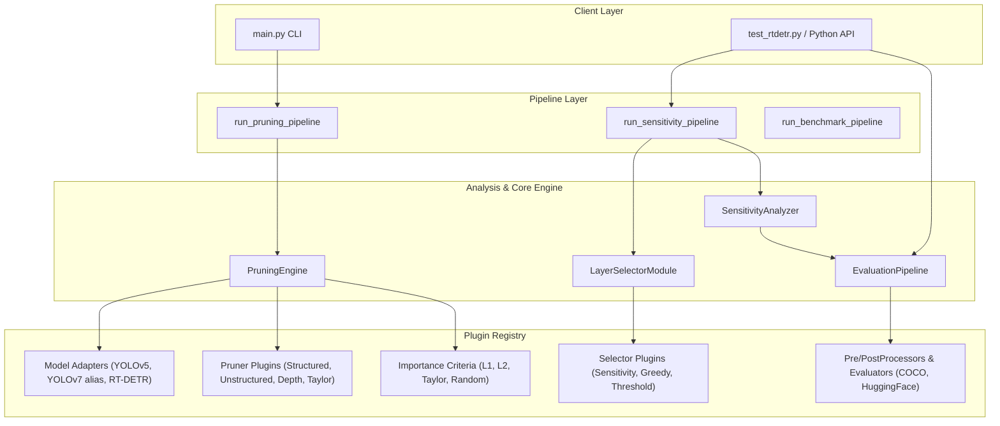

# Architecture Overview & Design System

The **Model Pruning Framework** is engineered around **Clean Architecture**, **Composition**, and the **Plugin Pattern**. All pruners, criteria, granularities, model adapters, layer selectors, and evaluation components operate as decoupled plugins, ensuring extreme extensibility and testability.

---

## 1. High-Level Architecture Diagram



---

## 2. Layer Responsibilities & Component Boundaries

The framework strictly enforces separation of concerns across layers. Each component has an explicit, bounded responsibility:

| Component | Module Location | Primary Responsibility | MUST NOT Handle |
| :--- | :--- | :--- | :--- |
| **`ModelLoader`** | `prune_framework.modules.model.loader` | Loading weights, state dicts, & initializing model architectures. | Evaluation, metric calculation, or pruning execution. |
| **`BaseModelAdapter`** | `prune_framework.contracts.adapter` | Inspecting model layers, providing dummy input tensors, layer mapping. | Applying pruning weights or calculating layer importance. |
| **`BasePruner`** | `prune_framework.contracts.pruner` | Mutating PyTorch layers (pruning channels, filters, or layers). | Calculating importance metrics or evaluating mAP score. |
| **`BaseImportanceCriterion`** | `prune_framework.contracts.criterion` | Computing layer/channel importance scores (e.g. L1-norm). | Modifying layer weights or executing model forward pass. |
| **`BasePreProcessor`** | `prune_framework.contracts.evaluation` | Converting raw images into model input tensors on target device. | Model forward execution, NMS, or metric calculation. |
| **`BasePostProcessor`** | `prune_framework.contracts.evaluation` | Decoding model logits/boxes into standardized `Detection` objects. | mAP computation, sensitivity analysis, or layer pruning. |
| **`BaseEvaluator`** | `prune_framework.contracts.evaluation` | Comparing predictions with ground truth to compute metrics (`map`). | Loading models, pre-processing, or pruning layers. |
| **`SensitivityAnalyzer`** | `prune_framework.modules.analysis.sensitivity` | Sweeping pruning rates per layer and recording `SensitivityResult`. | Selecting target layer rates or deciding pruning strategy. |
| **`LayerSelectorModule`** | `prune_framework.modules.analysis.layer_selection` | Interpreting `SensitivityResult` and choosing rates per layer. | Modifying model weights or running evaluation loops. |
| **`PruningEngine`** | `prune_framework.core.engine` | Orchestrating model adapter, pruner, criterion, & granularity. | Experiment reporting or user interface logic. |

---

## 3. Composition & Plugin Registration Pattern

Plugins are decoupled classes that inherit from contract abstract base classes and register themselves via decorators into `PluginRegistry`:

```python
from prune_framework.contracts import BaseSelector
from prune_framework.core.registry import register_selector

@register_selector("my_custom_selector")
class MyCustomSelector(BaseSelector):
    def select_layers(self, sensitivity_data, target_sparsity, **kwargs):
        # Implementation...
        pass
```

### Discovery & Lifecycle
1. When `PluginRegistry.get_*()` is called, `PluginRegistry._ensure_plugins_loaded()` automatically imports all modules in `prune_framework.plugins`.
2. Decorators (`@register_model_adapter`, `@register_pruner`, `@register_criterion`, `@register_granularity`, `@register_selector`) record mapping names in internal dictionaries.
3. Callers instantiate plugins dynamically by string name (`PluginRegistry.get_selector("sensitivity")()`).

---

## 4. End-to-End Data Flow

The following sequence details how data objects move across components during sensitivity analysis, layer selection, and pruning:

```text
Config / User Parameters
       ↓
Model Weight File (.pt / .pth / HuggingFace)
       │
       ▼ (ModelLoader)
PyTorch nn.Module instance
       │
       ▼ (SensitivityAnalyzer + EvaluationPipeline)
SensitivityResult (Immutable Dataclass)
  ├── baseline_score: float
  ├── profiles: Dict[int, LayerSensitivityProfile]
  │     └── points: Dict[rate, SensitivityPoint(rate, score, metric_drop, relative_drop, is_valid)]
  └── metadata: Dict[str, Any]
       │
       ▼ (LayerSelectorModule + BaseSelector Plugin)
SelectionResult (Immutable Dataclass & Iterable Tuples)
  ├── selected_layers: List[SelectedLayer(idx, name, target_rate, expected_metric, expected_drop)]
  └── strategy_name: str
       │
       ▼ (PruningEngine + Pruner / Adapter / Criterion Plugins)
PruningResult
  ├── model: nn.Module (Pruned)
  ├── params_before: int
  ├── params_after: int
  ├── params_reduction_pct: float
  └── forward_verified: bool
```
