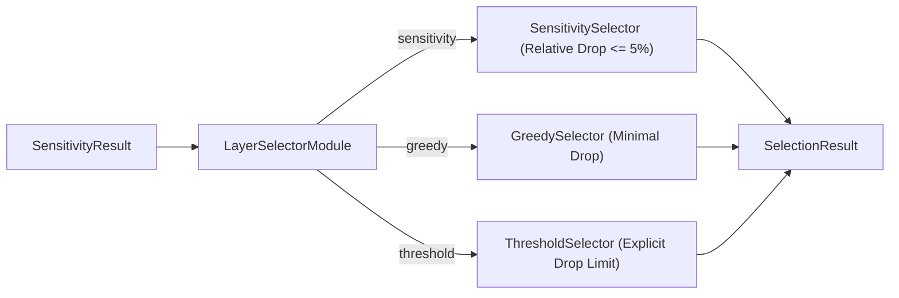

# Core Concepts: Pruning, Sensitivity Analysis, & Evaluation

This document explains the core technical concepts powering the pruning framework: pruning strategies, sensitivity analysis, layer selection, and evaluation pipelines.

---

## 1. Pruning Strategies & Granularities

Pruning reduces model parameter counts and FLOPs by removing redundant weights, channels, or layers.

### A. Structured Channel Pruning (`structured`)
* **Mechanism**: Evaluates channel importance (e.g., L1-norm of convolutional kernel weights) and removes physical input/output channels across connected layers.
* **Impact**: Directly reduces tensor dimensions, GPU memory footprint, and latency without requiring specialized sparse hardware inference engines.
* **Granularity**: `channel`

### B. Unstructured Sparsity (`unstructured`)
* **Mechanism**: Zeros out individual weight values below an importance threshold across weight matrices.
* **Impact**: High compression ratio while maintaining theoretical accuracy, but requires sparse acceleration libraries for latency gains.
* **Granularity**: `filter` / elementwise

### C. Depth / Layer Pruning (`depth` / `prune-layer`)
* **Mechanism**: Evaluates complete residual block or bottleneck module importance and removes entire layers from deep networks (e.g. C3 bottleneck blocks in YOLOv5 or transformer layers).
* **Impact**: Reduces model depth, significantly lowering latency on edge devices.
* **Granularity**: `layer`

### D. Taylor Expansion Pruning (`taylor`)
* **Mechanism**: Approximates the loss change resulting from pruning weights using first-order Taylor expansion gradients:
  $$I_i = \left| W_i \cdot \frac{\partial \mathcal{L}}{\partial W_i} \right|$$
* **Impact**: Identifies channels that have minimal impact on the task loss function during calibration forward/backward passes.

---

## 2. Sensitivity Analysis (SA)

Sensitivity Analysis profiles a model layer-by-layer before pruning to determine which layers are robust and which are sensitive to compression.

### Workflow
1. **Baseline Evaluation**: Evaluates unpruned model $M$ to establish baseline metric $S_0$ (e.g. mAP = 0.85).
2. **Layer Sweep Loop**: For each pruneable layer $i \in \{0 \dots L-1\}$ and pruning rate $r \in \{0.1, 0.2, 0.3, 0.5\}$:
   - Deepcopy model $M \to M'$.
   - Apply temporary pruning at rate $r$ to layer $i$.
   - Evaluate metric $S_{i, r}$ on validation dataset.
   - Calculate metric drop $\Delta = S_0 - S_{i, r}$ and relative drop $\Delta_{\text{rel}} = \frac{S_0 - S_{i, r}}{S_0}$.
   - Capture `SensitivityPoint(rate, score, metric_drop, relative_drop, is_valid)`.
3. **Packaging**: Returns structured `SensitivityResult`.

---

## 3. Layer Selection Strategies

Once sensitivity profiles are built, a **Layer Selector** chooses the optimal pruning rate per layer under a target sparsity cap.



### A. `SensitivitySelector` ("sensitivity")
* **Policy**: Selects the maximum pruning rate per layer $r \le \text{target\_sparsity}$ such that the relative metric drop stays within `max_allowed_relative_drop` (default 5% / `0.05`).
* **Behavior**: Sensitive layers whose accuracy degrades beyond 5% receive rate `0.0` (protected from pruning), while robust layers are pruned at higher rates.

### B. `GreedySelector` ("greedy")
* **Policy**: Evaluates all valid pruning rates $r \le \text{target\_sparsity}$ and selects the rate that achieves the best metric score (minimal degradation).
* **Behavior**: Prioritizes accuracy preservation across candidate rates.

### C. `ThresholdSelector` ("threshold")
* **Policy**: Allows setting explicit absolute drop thresholds (`max_allowed_drop`) or relative drop thresholds (`max_allowed_relative_drop`).
* **Behavior**: Flexible rule-based thresholding for custom tolerance requirements.

---

## 4. Decoupled Evaluation Pipeline

Evaluation is structured into four single-responsibility stages:

```text
PreProcessor (BasePreProcessor)
  ├── Input: Raw images / dataset batch
  └── Output: PyTorch input tensors on device (pixel_values)
        ↓
Inference / Model Execution
  ├── Input: Input tensors
  └── Output: Raw model logits & bounding box outputs
        ↓
PostProcessor (BasePostProcessor)
  ├── Input: Model outputs, target image sizes, confidence threshold
  └── Output: Standardized List[Detection] objects (image_id, category_id, score, bbox)
        ↓
Evaluator (BaseEvaluator / COCOEvaluator)
  ├── Input: List[Detection] & Ground truth annotations
  └── Output: EvaluationResult (metrics={"map": 0.85, "map50": 0.92, ...})
```

### Standardized Prediction & Result Contracts
* **`Detection`**: Immutable dataclass containing `image_id`, `category_id`, `score`, `bbox: (x_min, y_min, w, h)`.
* **`EvaluationResult`**: Immutable result containing `metrics: Dict[str, float]`, `num_samples: int`, and `metadata: Dict[str, Any]`.
