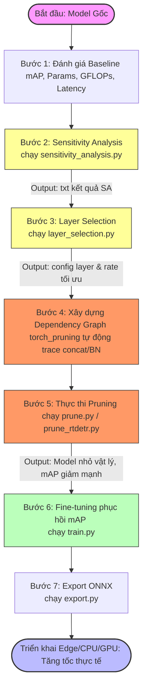
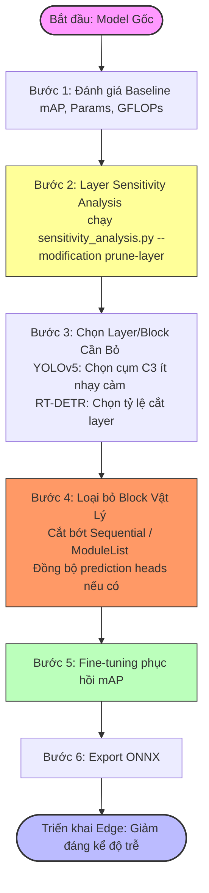
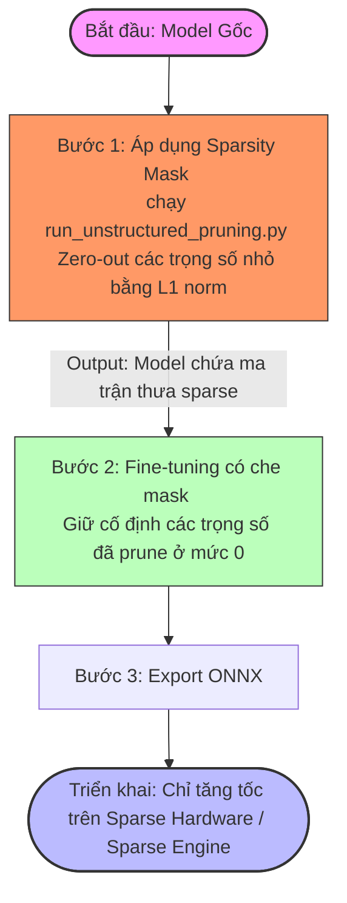

# Quy Trình (Workflow) Tối Ưu Hóa & Nén Mô Hình: YOLOv5 & RT-DETR

Tài liệu này chuẩn hóa và phân định rõ ràng 3 quy trình (workflow) nén mô hình trong dự án: **Structured Channel (Width) Pruning**, **Structured Layer (Depth) Pruning**, và **Unstructured Pruning**. 

Sự nhầm lẫn trước đây xảy ra do việc gộp chung 3 phương pháp này vào một pipeline tuyến tính duy nhất. Thực tế, mỗi phương pháp có yêu cầu kỹ thuật, các bước thực thi, và khả năng tăng tốc phần cứng khác nhau hoàn toàn.

---

## 📌 Bảng so sánh nhanh 3 Quy trình

| Đặc tính / Bước | 1. Structured Channel (Width) | 2. Structured Layer (Depth) | 3. Unstructured |
| :--- | :--- | :--- | :--- |
| **Mục tiêu nén** | Cắt bớt số lượng channels/filters (thu hẹp chiều rộng) | Loại bỏ nguyên block/layer (giảm chiều sâu mô hình) | Zero-out các trọng số nhỏ (giữ nguyên hình dạng tensor) |
| **Phân tích Sensitivity** | **Bắt buộc** (từng lớp Conv ở các mức rate) | **Bắt buộc** (đánh giá độ nhạy của các block C3 / Transformer) | **Không cần** (áp dụng tỷ lệ chung cho toàn bộ trọng số) |
| **Layer Selection** | **Bắt buộc** (thuật toán tìm kiếm tối ưu hóa GFLOPs/Params) | **Thủ công hoặc tỉ lệ** (chọn cụm C3 dư thừa / cắt tỉ lệ layer) | **Không cần** (cắt đều hoặc cắt global dựa trên ngưỡng L1) |
| **Dependency Graph (DepGraph)**| **Bắt buộc** (để đồng bộ chiều ra Conv, BN và chiều vào lớp kế tiếp) | **Không cần** (chỉ bypass/remove block trong Sequential) | **Không cần** (không thay đổi kích thước tensor) |
| **Speedup thực tế** | **Có ngay** trên mọi phần cứng (CPU/GPU/Edge) & ONNX | **Có ngay** trên mọi phần cứng (CPU/GPU/Edge) & ONNX | **Chỉ có** khi dùng phần cứng đặc biệt hoặc Sparse Engine |

---

## 1. Quy trình chi tiết của từng phương pháp

### Quy trình A: Structured Channel (Width) Pruning
> **Ý nghĩa:** Cắt giảm số bộ lọc (channels) kém quan trọng. Đây là quy trình phức tạp nhất vì thay đổi trực tiếp cấu trúc tensor và cần đồng bộ hóa chuỗi liên kết (Domino effect) qua Dependency Graph.

* **Lệnh chạy YOLOv5:**
  1. *Sensitivity Analysis:* `python sensitivity_analysis.py --modification prune-structured --pruning-rate "[0.25, 0.5, 0.75]"`
  2. *Layer Selection:* `python layer_selection.py --output output/yolov5s --params 7225885 --flops 16.436 --params-layers 6`
  3. *Prune & Save:* `python prune.py --modification prune-structured --pruning-params "[(0, 0.25), (42, 0.5)]" --name weights/pruned.pt`
  4. *Fine-tuning:* `python train.py --weights weights/pruned.pt --epochs 50`

---

### Quy trình B: Structured Layer (Depth) Pruning
> **Ý nghĩa:** Loại bỏ các block tính toán lặp lại (ví dụ: Bottleneck trong block C3 của YOLOv5 hoặc các layer Encoder/Decoder trong RT-DETR) để giảm độ trễ do số lượng lớp sâu.

* **Lệnh chạy YOLOv5:**
  1. *Layer Sensitivity:* `python sensitivity_analysis.py --modification prune-layer --criterion 0`
  2. *Prune & Save:* `python prune.py --modification prune-layer --pruning-params "[(4,1),(6,1)]" --name weights/layer-pruned.pt`
  3. *Fine-tuning:* `python train.py --weights weights/layer-pruned.pt --epochs 50`

---

### Quy trình C: Unstructured Pruning
> **Ý nghĩa:** Đặt các trọng số (weight) có giá trị tuyệt đối nhỏ về 0. Tensor không thay đổi kích thước vật lý, do đó không xảy ra lỗi bất tương thích chiều, không cần phân tích độ nhạy của từng lớp và không cần Dependency Graph.

* **Lệnh chạy sweep & benchmark tự động:**
  `python run_unstructured_pruning.py --benchmark --data data/coco50.yaml --yolo-weights weights/yolov5s.pt`
* **Lưu ý triển khai:** Khác với 2 phương pháp trên, mô hình Unstructured Pruning xuất ra ONNX thông thường **sẽ KHÔNG chạy nhanh hơn** trên các thiết bị CPU/GPU phổ thông, vì các toán tử tensor dense chuẩn vẫn tính toán các giá trị 0 này. Nó chỉ giúp giảm dung lượng nén file (khi zip/gzip) hoặc khi chạy trên phần cứng hỗ trợ tính toán thưa (ví dụ: NVIDIA Ampere với cấu trúc thưa 2:4) hoặc runtime chuyên dụng (ví dụ: Neural Magic DeepSparse).

---

## 2. Các điểm mấu chốt để tránh bị "Confuse" khi giải trình quy trình

1. **Phân biệt rõ Width Pruning vs Depth Pruning:**
   * *Width (Channel) Pruning* cắt giảm kênh lọc $\rightarrow$ Làm cho mô hình "gầy" đi. Cần thuật toán lựa chọn layer tự động vì có hàng chục lớp Conv xen kẽ concat.
   * *Depth (Layer) Pruning* bỏ bớt khối $\rightarrow$ Làm mô hình "lùn" đi. Số lượng layer prunable cực kỳ ít (ví dụ: YOLOv5s chỉ có 2 block C3 prunable ở backbone). Do đó, bước chọn layer đơn giản hơn nhiều.

2. **Sự cần thiết của Dependency Graph:**
   * Hãy giải thích rằng trong YOLOv5, các đặc trưng được ghép nối (Concatenate) từ nhiều tầng khác nhau (ví dụ: các đường nối tắt PANet/FPN).
   * Khi ta cắt bớt 10 kênh ở Layer A, nếu không cập nhật Layer B (nhận đầu vào của A) và Layer C (nối concat với A), mô hình sẽ lập tức bị lỗi lệch kích thước ma trận (`RuntimeError: size mismatch`).
   * Việc tích hợp thư viện `torch_pruning` giúp tự động hóa khâu vẽ Dependency Graph để lan truyền việc cắt giảm sang các layer liên quan, đây là xương sống của **Structured Width Pruning**.

3. **Tính chất tăng tốc thực tế (Hardware Acceleration):**
   * Giải thích rõ vì sao Unstructured Pruning không cần các bước phân tích nhạy cảm phức tạp nhưng lại khó triển khai thực tế: vì nó cần phần cứng chuyên dụng để bỏ qua các phép nhân với số 0.
   * Structured Pruning (cả Width và Depth) thay đổi kích thước vật lý của mảng trọng số, chuyển từ `[64, 32, 3, 3]` thành `[48, 32, 3, 3]`. Mọi thư viện ONNX Runtime, TensorRT, OpenVINO đều lập tức chạy nhanh hơn mà không cần cấu hình đặc biệt.
